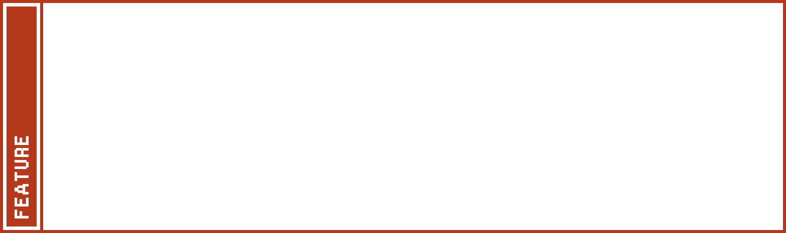

<p align="center"></p>

Cassette is a lightweight framework written in C11, with a UI inspired by the cassette-futurism aesthetic. Built for modern POSIX systems, it includes three main components: a custom GUI toolkit (CGUI), a configuration language and parser (CCFG), and a set of high-level data structures (COBJ). The API is designed in a (somewhat) safe C style, where any structure relying on dynamic memory allocation is opaque, and its handler functions are built to avoid null pointer returns. In short, unless there's a specific exception, functions — including constructors — always return valid values or pointers, even if memory allocation fails. There are also thick Ada bindings available.

Cassette is free and open-source software, licensed under the [LGPL-3.0](https://www.gnu.org/licenses/lgpl-3.0.en.html).

> [!WARNING]
> Readme and documentation under construction.

## Table of Contents <a name="toc"></a>

- [Libraries Overview](#overview)
- [CGUI features](#cgui)
- [CCFG features](#ccfg)
- [COBJ features](#cobj)
- [Dependencies](#dependencies)
- [Build and installation](#build)
- [Post-Installation](#post-install)
- [Usage](#usage)
- [Gallery](#gallery)
- [Mirrors](#mirrors)

## Libraries Overview <a name="overview"></a>

### CGUI

A dynamic GUI toolkit library designed as a universal interface, equally targeting desktop, laptop, mobile, and miscellaneous devices with more or less limited inputs. All thanks to a flexible grid layout, simple widget appearance, and an advanced configuration system powered by CCFG, allowing one to tailor the theme, behavior, keybinds and input interpretation for each device class.

### CCFG

A configuration language and parser library featuring array based values and short s-like expressions based functions. The language's syntax aims to be both human-readable and easy to parse. Yet provides enough tools to the end user to create branching and dynamic configurations that can be modified and reloaded on the fly.

### COBJ

A collection self-contained data structures and utilities used by both CCFG and CGUI.

<div align="right">[ <a href="#toc">back to top</a> ]</div>

## CGUI Features<a name="cgui"></a>

<p align="center"></p>
<p align="center"></p>
<p align="center"></p>
<p align="center"></p>
<p align="center"></p>
<p align="center"></p>
<p align="center"></p>

<div align="right">[ <a href="#toc">back to top</a> ]</div>

## CCFG Features <a name="ccfg"></a>

- comments
- user-defined sections
- user-defined variables
- program-defined parameters
- arithmetic operations
- string operations
- color operations
- iteration loops
- conditionals
- child file inclusion
- [more](docs/ccfg-spec.md)

<div align="right">[ <a href="#toc">back to top</a> ]</div>

## COBJ Features <a name="cobj"></a>

- **cbook**: dynamic C-strings stack with grouping features
- **ccolor**: RGBA color representation, manipulation and conversion
- **cdict**: hashmap with string + group keys, FNV-1A hashing and linear probing
- **cerr**: error codes used by every Cassette component
- **cinputs**: 2D input (screen touches, key / button presses) tracker array
- **crand**: re-implementation of POSIX's rand48 functions with a slightly more convenient API
- **cref**: reference counter used to keep track of instanced components
- **cseg**: 1D segment represenation and manipulation with bound checks and UB prevention
- **cstr**: UTF-8 strings with 2D (rows, columns, tabsize, wrapping) features

<div align="right">[ <a href="#toc">back to top</a> ]</div>

## Dependencies <a name="dependencies"></a>

### Tools :

- C11 compiler with a stdlib + POSIX 200809L
- Make

### Libraries :

- [Cairo](https://cgit.freedesktop.org/cairo/)
- [FontConfig](https://gitlab.freedesktop.org/fontconfig/fontconfig)
- [XKBCommon](https://github.com/xkbcommon/libxkbcommon)
- [XCB](https://gitlab.freedesktop.org/xorg/lib/libxcb), with:
	- ICCCM
	- Keysyms
	- Present
	- Randr
	- Render
	- XInput

<div align="right">[ <a href="#toc">back to top</a> ]</div>

## Build and Installation <a name="build"></a>

First, edit the makefile if you want to change the installation destinations. These are represented by the variables `DIR_INSTALL_INC` and `DIR_INSTALL_LIB` for the public API headers and library files respectively. By default, they are set to `/usr/include/cassette/` and `/usr/lib`.
Then, build and install Cassette with the following commands (Examples will also be built and placed under `*/build/bin`):

```
make
make install
```

Once you're done you can get rid of build files with:

```
make clean
```

If you want to uninstall the library, run:

```
make uninstall
```

<div align="right">[ <a href="#toc">back to top</a> ]</div>

## Post-Installation <a name="post-install"></a>

By default, the CGUI library is set to use the font "Monospace" with size 14 because it currently does not ship with its own built-in font. But because the windows geometry is dependent on the font, it is recommended to customize your font before anything else. Do note, that the font must be mono-spaced since CGUI has been specifically developed around this class of font. To set it, create a configuration file `~/.config/cgui.conf` and add to it these two lines :

```
font face "FONT_NAME"
font size  VALUE
```

Replace `FONT_NAME` and `VALUE` with your preferred font name and size. The font name follows the FontConfig naming convention. After that, if the rendered text still looks wrong, check out the other font configuration parameters in the [sample configuration file](cgui/test/cgui.conf) and add them to your current configuration to further tweak font rendering. 

<div align="right">[ <a href="#toc">back to top</a> ]</div>

## Usage <a name="usage"></a>

Add the following includes to get access to Cassette libraries :

```
#include <cassette/cgui.h>
#include <cassette/ccfg.h>
#include <cassette/cobj.h>
```

As well as these compilation flag :

```
-lcgui
-lccfg
-lcobj
```

<div align="right">[ <a href="#toc">back to top</a> ]</div>

## Gallery <a name="gallery"></a>


<div align="right">[ <a href="#toc">back to top</a> ]</div>

## Credits <a name="credits"></a>

The following third-party resources were used to make the visuals :

- [Terminus font](https://terminus-font.sourceforge.net/)
- [Scientifica font](https://github.com/nerdypepper/scientifica)
- [Sevastopol Interface font](https://www.dafont.com/sevastopol-interface.font)
- [NASA Curiosity's view of Mars sky at sunset](https://www.nasa.gov/)
- [Picom for shadow and blur effects](https://github.com/yshui/picom)

<div align="right">[ <a href="#toc">back to top</a> ]</div>

## Mirrors <a name="mirrors"></a>

- https://github.com/fraawlen/cassette-graphics
- https://codeberg.org/fraawlen/cassette-graphics

<div align="right">[ <a href="#toc">back to top</a> ]</div>
