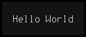
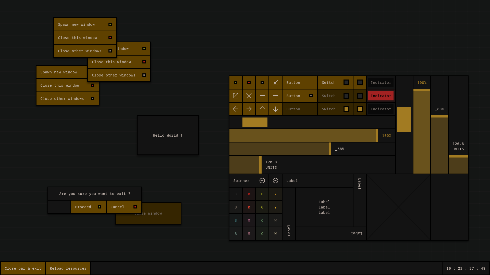
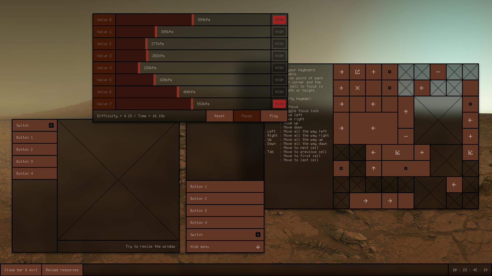
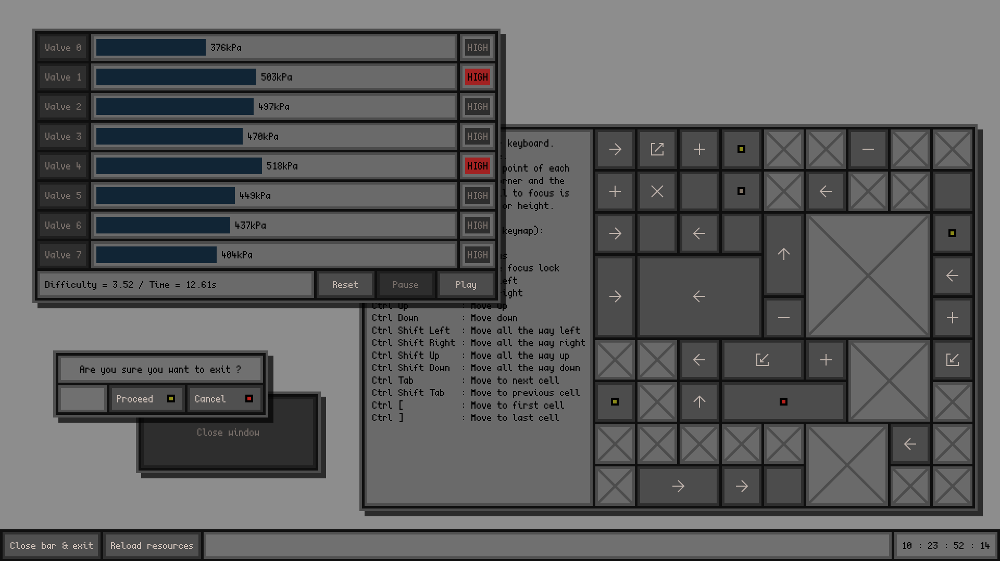

<p align=center></p>

Cassette Graphics, or Cassette GUI (CGUI) is a modular general-purpose GUI toolkit written in C for X11 end-user applications. It's designed as a universal GUI, equally targeting desktop, laptop, mobile, and miscellaneous devices with more or less limited inputs. All thanks to a flexible grid layout, simple widget appearance, and an advanced configuration system, allowing one to tailor the theme, behavior, keybinds and input interpretation for each device class. CGUI also tries to limit the amount of direct external dependencies to make it easier to set it up on any system running an X11 display server.

The library is free and open-source software licensed under the [LGPL-2.1](https://www.gnu.org/licenses/old-licenses/lgpl-2.1.html). It's made to run on modern POSIX-compliant systems.

Features
--------

- C API
- Retained mode
- Responsive layouts
- Font based window geometry
- Pointer, Keyboard and Multi-Touch inputs
- Run-time configuration and theme reload
- Custom widgets support
- Enhanced WM hinting
- Fractional scaling
- Native transparency
- Vertically synced animations

Dependencies
------------

- Tools :

	- C11 compiler with a stdlib + POSIX 200809L
	- Make

- First-party libraries :

	- [Cassette-Configuration](/../../../../fraawlen/cassette-configuration)
	- [Cassette-Objects](/../../../../fraawlen/cassette-objects)

- Third-party libraries :

	- [Cairo](https://cgit.freedesktop.org/cairo/)
	- [FontConfig](https://gitlab.freedesktop.org/fontconfig/fontconfig)
	- [XCB](https://gitlab.freedesktop.org/xorg/lib/libxcb)
	- [XKBCommon](https://github.com/xkbcommon/libxkbcommon)

Installation
------------

First, edit the makefile if you want to change the installation destinations. These are represented by the variables DEST_HEADERS and DEST_LIBS for the public API headers and library files respectively. By default, they are set to /usr/include/cassette/ and /usr/lib. Then, build and install CGUI with the following commands :

```
make
make install
```

After these steps, a shared binary will be generated and installed on your system. Examples will also be built and placed under `build/bin`.

Post-Installation
-----------------

By default, the library is set to use the font "Monospace" with size 14 because it currently does not ship with its own built-in font. But because the windows geometry is dependent on the font, it is recommended to customize your font before anything else. Do note, that the font must be mono-spaced since CGUI has been specifically developed around this class of font. To set it, create a configuration file `~/.config/dg.conf` and add to it these two lines :

```
font face "FONT_NAME"
font size  VALUE
```

Replace `FONT_NAME` and `VALUE` with your preferred font name and size. The font name follows the FontConfig naming convention. After that, if the rendered text still looks wrong, check out the other font configuration parameters `core.font_*` in the [sample configuration file](dg.conf) and add them to your current configuration to further tweak font rendering. A few themes are also provided in the `theme` directory. To install them, simply copy paste their contents into your working configuration file.

Usage
-----

Add this include to get access to the library functions :

```
#include <cassette/cgui.h>
```

As well as this compilation flag :

```
-lcgui
```

Minimal Example
---------------

One of the simplest GUI programs, a HelloWorld :

```c
#include <cassette/cgui.h>

int
main(int argc, char **argv)
{
	cgui_window *window;
	cgui_grid   *grid;
	cgui_label  *label;

	/* library modules initialisation */

	cgui_init(argc, argv);

	/* object instantiation */

	window = cgui_window_create();
	grid   = cgui_grid_create(1, 1);
	label  = cgui_label_create();

	/* cell configuration */

	cgui_label_set(label, "Hello World");
	
	/* grid configuration */

	cgui_grid_resize_col(grid, 0, 11);
	cgui_grid_assign_cell(grid, label, 0, 0, 1, 1);
	
	/* window configuration */

	cgui_window_push_grid(window, grid);
	cgui_window_activate(window);

	/* run */

	cgui_run();

	/* end */

	return 0;
}
```

Compile with :

```
cc hello.c -lcgui
```

Output :



Check out the `examples` directory for more in depth demonstrations.

Screenshots
-----------





In these screenshots, the following third-party resources were used :

- [Terminus font](https://terminus-font.sourceforge.net/)
- [Scientifica font](https://github.com/nerdypepper/scientifica)
- [NASA Curiosity's view of Mars sky at sunset](https://www.nasa.gov/)
- [Picom for shadow and blur effects](https://github.com/yshui/picom)

Mirrors
-------

- https://codeberg.org/fraawlen/cassette-graphics
- https://github.com/fraawlen/cassette-graphics
