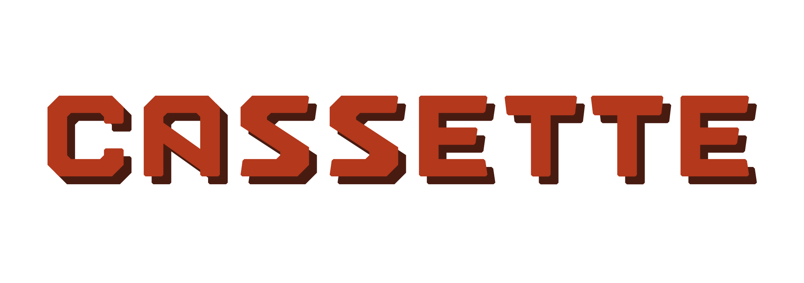

<p align="center"></p>

Cassette Configuration (CCFG) is a configuration language and parser library featuring array based values and short s-like expressions based functions. The language's syntax aims to be both human-readable and easy to parse. Yet provides enough tools to the end user to create branching and dynamic configurations that can be modified and reloaded on the fly.

The library is free and open-source software licensed under the [LGPL-2.1](https://www.gnu.org/licenses/old-licenses/lgpl-2.1.html). It's made to run on modern POSIX-compliant systems, and except for the compiler and build system, is not dependent on third-party software.

Language Features
-----------------

- comments
- user-defined sections
- user-defined variables
- program-defined parameters
- arithmetic operations
- string operations
- color operations
- iteration loops
- conditionals
- child file inclusion
- [more](./doc/spec.md)

Dependencies
------------

- Tools :

	- C99 compiler with a stdlib + POSIX 200809L
	- Make
	- Xxd (optional, is only needed to build examples)

- First-party libraries :

	- [Cassette-Objects (COBJ)](https://codeberg.org/fraawlen/cassette-objects)

Installation
------------

First, edit the makefile if you want to change the installation destinations. These are represented by the variables `DEST_HEADERS` and `DEST_LIBS` for the public API headers and library files respectively. By default, they are set to `/usr/include/cassette/` and `/usr/lib`.
Then, build and install CCFG with the following commands :

```
make
make install
```

After these steps, both a shared binary and static archive will be generated and installed on your system. Examples will also be built and placed under `./build/bin`. The examples are statically compiled and can be run from anywhere on your system.

Usage
-----

Add this include to get access to the library functions :

```
#include <cassette/ccfg.h>
```

As well as this compilation flag :

```
-lccfg
```

Minimal Example
---------------

The following code snippet shows a minimal example of the library usage. When compiled and run, it will look for the file `/tmp/ccfg` and load its contents. It then attempts to fetch a resource named `property` under the namespace `namespace`, and if found, prints its values.

```c
#include <stdio.h>
#include <cassette/ccfg.h>

int
main(void)
{
	ccfg_t *cfg = ccfg_create();

	ccfg_push_source(cfg, "/tmp/ccfg");
	ccfg_load(cfg);

	ccfg_fetch(cfg, "namespace", "property");
	while (ccfg_pick_next_value(cfg))
	{
		printf("%s\n", ccfg_get_value(cfg));
	}

	return 0;
}
```

A matching minimal CCFG configuration in `/tmp/ccfg` will then look like this :

```
namespace property value_A value_B
```

Output :

```
value_A
value_B
```

Check out the `examples` directory for more in depth demonstrations and `include/cassette/*.h` header files for full functions descriptions. For more information about the language usage, features and syntax check out the [language spec](./doc/spec.md).

Mirrors
-------

- https://codeberg.org/fraawlen/cassette-configuration
- https://github.com/fraawlen/cassette-configuration

