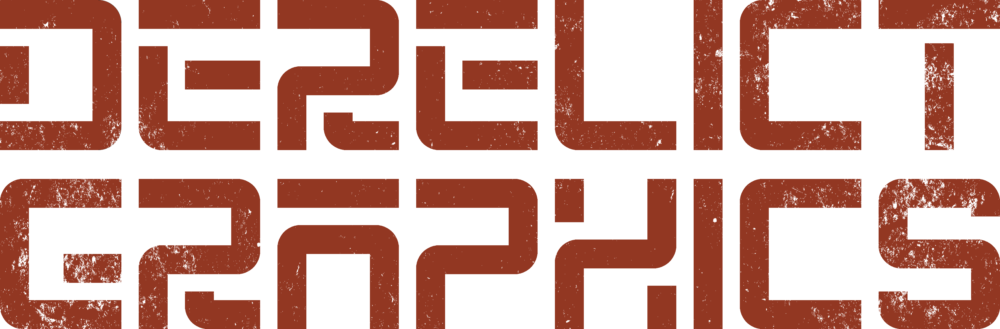
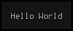
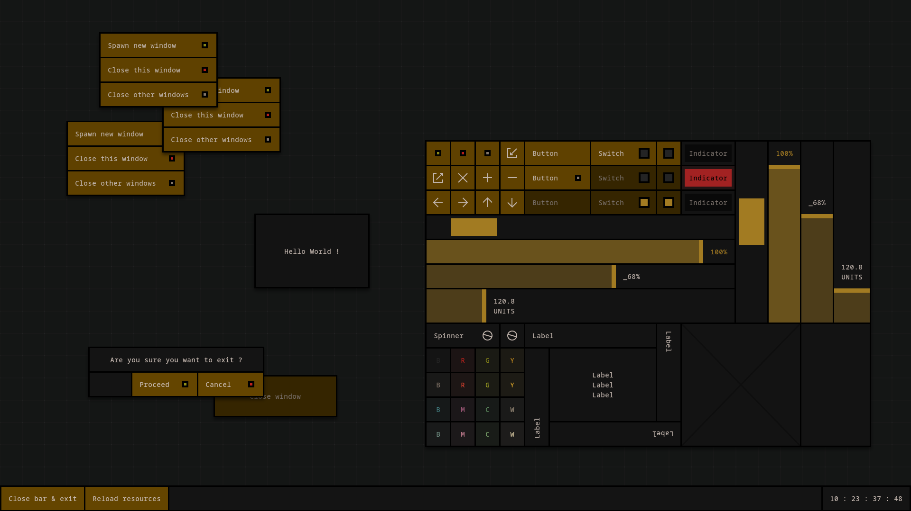
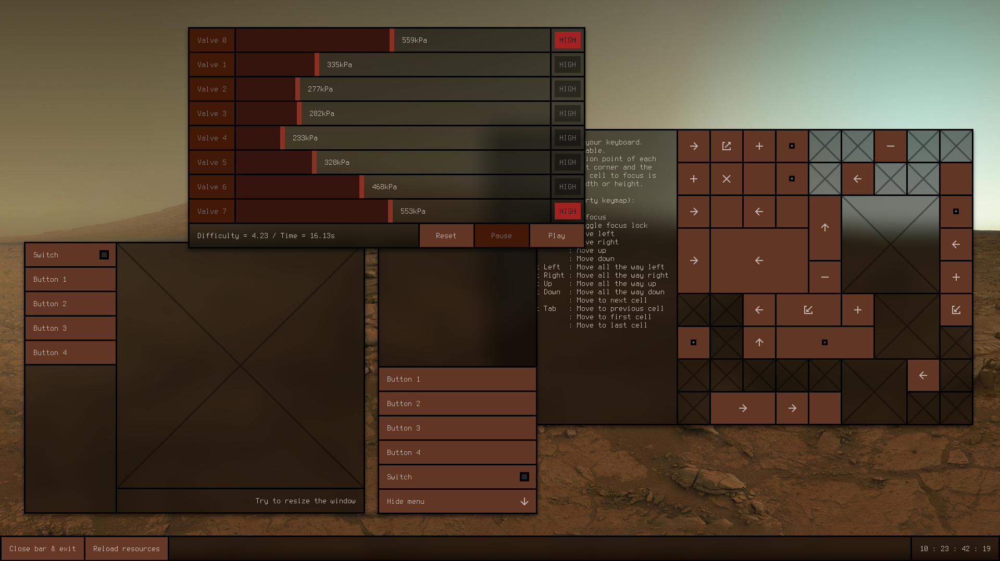
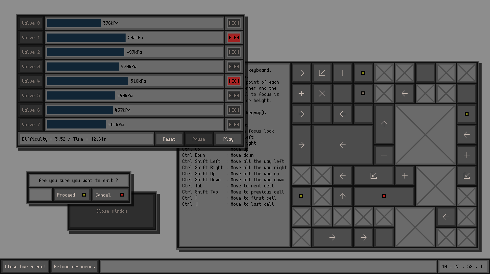

## Gist

Derelict Graphics (DG) is a modular general-purpose GUI toolkit written in C11 for X11 end-user applications. It's designed as a universal GUI, equally targeting desktop, laptop, mobile, and miscellaneous devices with more or less limited inputs. All thanks to a flexible grid layout, simple widget appearance, and an advanced configuration system, allowing one to tailor the theme, behavior, keybinds and input interpretation for each device class. DG also tries to limit the amount of direct external dependencies to make it easier to set it up on any system running an X11 display server.

Notable features :

- C API
- Retained mode
- Responsive layouts
- Mono-spaced font based window geometry
- Pointer, Keyboard and Multi-Touch inputs
- Run-time configuration and theme reload
- Custom widgets (aka cells) support
- Enhanced WM hinting
- Fractional scaling
- Native transparency
- Vertically synced animations

## Status

Latest release version : **0.1.0 BETA**

DG just got its first public release and is currently BETA software : what's implemented is operational, but some components (mostly cells / widgets) are still missing and will be made available in the upcoming releases. Therefore, it's not yet feature-complete and changes in the API or configuration options are to be expected. Stability may also be lacking since the project is young and has not been yet extensively tested under a myriad of conditions, but simple programs and the provided demos should not encounter any major issues.

The Core module, which is the library's engine, is mostly completed, and future updates of this module should hopefully only be QoL additions and not modifications of the existing API. The Base module which implements widgets, however, is still immature, and major changes to its API will probably happen.

Documentation specifying all key-binds, options, behaviors, concepts, design philosophy / guidelines,  and dictionary (for short variables names) is currently being written and should be published soon, along with a 3-part tutorial series about general library usage, custom widget creation, and custom module creation. In the meantime, consult the module headers, demos sources, and the sample configuration file. Said configuration file also includes the key-binds.
A website will also be put online soon at [derelict.graphics](https://derelict.graphics)

If you have any questions about this project, you can contact me by email : <fraawlen@posteo.net>

## Setup

### Requirements

To build DG you will need the following tools :
- C11 compiler with a stdlib + POSIX 200809L
- Make

As well as these direct dependencies :
- Cairo
- FontConfig
- XCB + Randr, Present and XInput extensions
- XKBCommon

### Build & Installation

Once you have met all the necessary requirements, you can build and install DG by simply running  :
```
make
make install
```

By default, headers and library binaries will be respectively placed in `/usr/include/dg`  and `/usr/lib`.
If you want to install them elsewhere modify the `DEST_HEADERS` and `DEST_LIBS` variables inside the makefile.

### Post-Installation

By default, the library is set to use the font "Monospace" with size 14 because it currently does not ship with its own built-in font. Therefore, as a font-dependent GUI it is recommended to customize your font before anything else. Do note, that the font must be mono-spaced since DG has been specifically developed around this class of font. To set it, create a configuration file `~/.config/dg.conf` and add to it these two lines :
```
core.font_face = "FONT_NAME"
core.font_size = VALUE
```
Replace `FONT_NAME` and `VALUE` with your preferred font name and size. The font name follows the FontConfig naming convention. After that, if the rendered text still looks wrong, check out the other font configuration parameters `core.font_*` in the sample configuration file and add them to your current configuration to further tweak font rendering.

### Demos

The DG project also includes 8 demo programs that showcase different use cases and capabilities of the library.
You can build them with the following command (you will need to build the library first, but installation is not necessary) :
```
make demos
```
The resulting executable binaries will be placed in `build/bin`.

### Clean-up

Once you're done with everything, you can remove all build files and demos programs binaries with :
```
make clean
```

## Example

One of the simplest GUI programs, a HelloWorld :
```
#include <dg/core/core.h>
#include <dg/base/base.h>

int
main(int argc, char **argv)
{
	/* library modules initialisation */
	dg_core_init(argc, argv, NULL, NULL, NULL);
	dg_base_init();
s/old-licenses/lgpl-2.1.html)
	/* object instantiation */
	dg_core_window_t *w = dg_core_window_create(DG_CORE_WINDOW_DEFAULT);
	dg_core_grid_t   *g = dg_core_grid_create(1, 1);
	dg_core_cell_t   *c = dg_base_label_create();

	/* cell configuration */
	dg_base_label_set_label(c, "Hello World");
	
	/* grid configuration */
	dg_core_grid_set_column_width(g, 0, 11);
	dg_core_grid_assign_cell(g, c, 0, 0, 1, 1);
	
	/* window configuration */
	dg_core_window_push_grid(w, g);
	dg_core_window_activate(w);

	/* run */
	dg_core_loop_run();

	/* end */
	return 0;
}
```
Compile with :
```
cc hello.c -ldg -ldg-base 
```
Output :



## Screenshots





In these screenshots, the following third-party resources were used :

- Terminus font
- Scientifica font
- NASA Curiosity's view of Mars sky at sunset
- Picom for shadow and blur effects

## Planned features

### Scheduled for next release
- Documentation + tutorial
- Cell component
	- Scroll bars
	- Sub-buttons
	- Context menus
- Cells
	- Lists
	- Combo-box
	- Slider
	- Canvas
	- Window embed
- Styling 
	- User set icons
- Accessibility
	- Screen reader support

### High priority
- Cell component 
	- Editable text zone
- Cells 
	- Prompt
	- Number input
	- Editable textbox
	- Table
	- Tree view
	- Icon view
	- Scroll wheel
	- Map
	- Images
	- Color button
	- Stack
- Meta cells
	- Side-panel
	- Resizable box

### Medium priority
- INCR clipboard support
- Non-text clipboard support
- Xdnd drag-and-drop support
- Focus sharing custom protocol
- Fix resource loading inefficiency
- Prebuilt dialog windows
- Meta cell
	- Hbox
	- Vbox

### Low priority
- Window WM icons
- Context dependent cursors
- Styling
	- Individual border thicknesses
	- Corner fillets and chamfers
	- Border bevels
	- Cell shadows

## License

[LGPL-2.1 License](https://www.gnu.org/licenses/old-licenses/lgpl-2.1.html)
