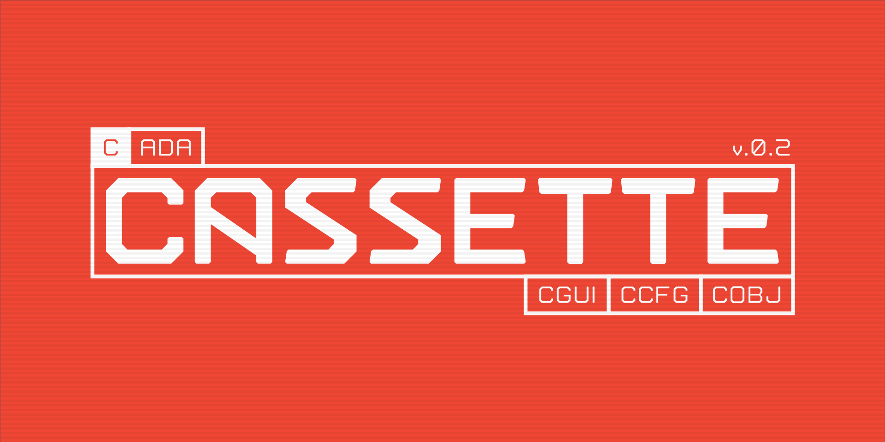
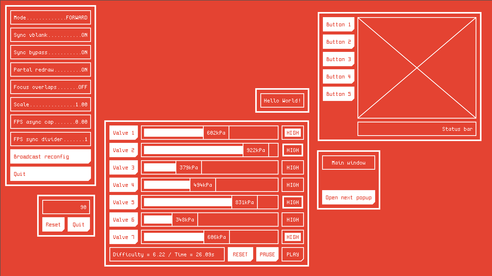
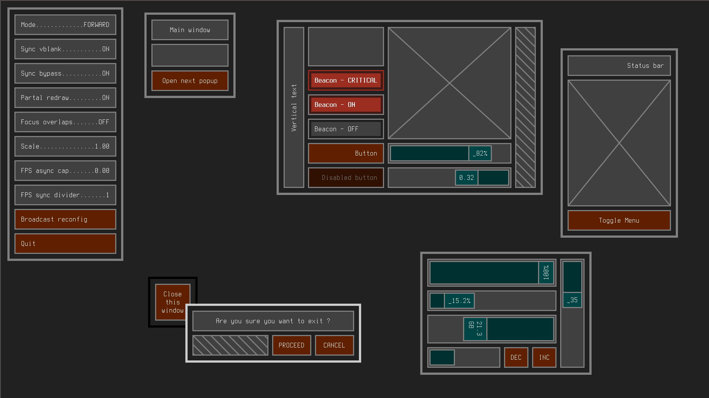
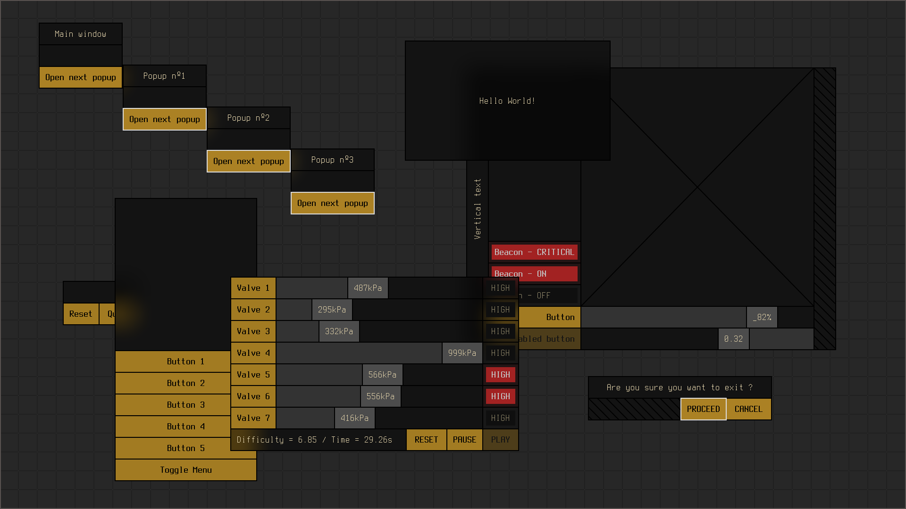
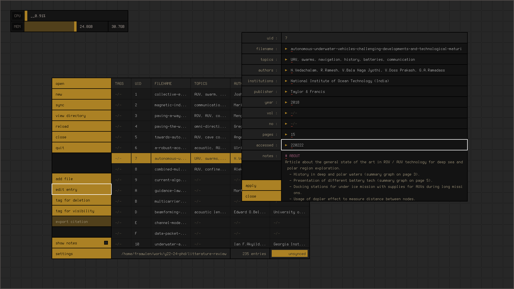

<h1 align="center"></h1>

Cassette is a GUI application framework written in C11, with a UI inspired by the cassette-futurism aesthetic. Built for modern POSIX systems, it's made out of three libraries: CGUI, CCFG and COBJ. Cassette is free and open-source software, licensed under the [LGPL-3.0](https://www.gnu.org/licenses/lgpl-3.0.en.html).

## Table of Contents <a name="toc"></a>

- [Overview](#overview)
- [Documentation](#documentation)
- [Dependencies](#dependencies)
- [Build and Installation](#build)
- [Post-Installation](#post-install)
- [Gallery](#gallery)
- [Planned Features](#future)
- [Third-Party Visual Resources](#credits)
- [Mirrors](#mirrors)

## Overview <a name="overview"></a>

#### [CGUI - Cassette Graphics](cgui)

The main component of the framework - a retained-mode X11 GUI toolkit library designed as a universal interface, equally targeting desktop, laptop, mobile, and miscellaneous devices with more or less limited inputs. All thanks to a flexible and responsive grid layout, simple widget appearance, and an advanced configuration system powered by CCFG, allowing one to tailor the theme, behavior, keybinds and input interpretation for each device class.

#### [CCFG - Cassette Configuration](ccfg)

A configuration language and parser library featuring array based values and short s-like expressions based functions. The language's syntax aims to be both human-readable and easy to parse. Yet provides enough tools to the end user to create branching and dynamic configurations that can be modified and reloaded on the fly.

#### [COBJ - Cassette Objects](cobj)

A collection of self-contained data structures and utilities shared by both CCFG and CGUI. Notably, it includes a versatile 2D UTF-8 string object with associated methods, designed for easy manipulation of strings in monospace text displays.

#### [Bindings](bindings/ada)

COBJ and CCFG Thick bindings for Ada 2012 are provided. CGUI bindings coming soon.

## Documentation <a name="documentation"></a>

- [UI model](docs/ui-model.md)
- [CGUI unique features](docs/cgui-features.md)
- [CGUI theming](docs/cgui-theming.md)
- [CCFG language](docs/ccfg-language.md)
- [API reference](docs/api-reference.md)

## Dependencies <a name="dependencies"></a>

Tools:

- C11 compiler with a stdlib + POSIX 200809L
- Make

Libraries:

- [Cairo](https://cgit.freedesktop.org/cairo/)
- [FontConfig](https://gitlab.freedesktop.org/fontconfig/fontconfig)
- [XKBCommon](https://github.com/xkbcommon/libxkbcommon)
- [XCB](https://gitlab.freedesktop.org/xorg/lib/libxcb)
- [XCB-ICCCM](https://gitlab.freedesktop.org/xorg/lib/libxcb-wm)
- [XCB-Keysyms](https://gitlab.freedesktop.org/xorg/lib/libxcb-keysyms)
- [XCB-Present](https://gitlab.freedesktop.org/xorg/lib/libxcb)
- [XCB-Randr](https://gitlab.freedesktop.org/xorg/lib/libxcb)
- [XCB-XInput](https://gitlab.freedesktop.org/xorg/lib/libxcb)

## Build and Installation <a name="build"></a>

First, edit the makefile if you want to change the installation destinations. These are represented by the variables `DIR_INSTALL_INC` and `DIR_INSTALL_LIB` for the public API headers and library files respectively. By default, they are set to `/usr/include/cassette/` and `/usr/lib`.
Then, build and install Cassette with the following commands (Examples will also be built and placed under the `*/build/bin` directory of each library):

```
make
make install
```

Optional step to install CCFG vim syntax highlighting:

```
make install-syntax
```

Once you're done you can get rid of build files with:

```
make clean
```

If you want to uninstall the library:

```
make uninstall
```

## Post-Installation <a name="post-install"></a>

By default, the CGUI library is set to use the font "Monospace" with size 14 because it currently does not ship with its own built-in font. But because the windows geometry is dependent on the font, it is recommended to customize your font before anything else. Do note, that the font must be mono-spaced since CGUI has been specifically developed around this class of font. To set it, create a configuration file `~/.config/cassette/cgui.ccfg` and add to it these two lines :

```
font face "FONT_NAME"
font size  VALUE
```

Replace `FONT_NAME` and `VALUE` with your preferred font name and size. The font name follows the FontConfig naming convention. After that, if the rendered text still looks wrong, check out the other font [configuration options](cgui/docs/cgui-theming.md) and add them to your current configuration to further tweak font rendering. 

## Usage

Add these includes to access the functions of each library :

```
#include <cassette/cgui.h>
#include <cassette/ccfg.h>
#incluce <cassette/cobj.h>
```

As well as these compilation flags :

```
-lcgui
-lccfg
-lcobj
```
Minimal examples:

- [Hello world window](docs/cgui-example.md)
- [Simple resource lookup](docs/ccfg-example.md)

More elaborate demos:

- [CGUI](cgui/examples)
- [CCFG](ccfg/examples)
- [COBJ](cobj/examples)

## Gallery <a name="gallery"></a>

<table> 
<tr>
<td></td> 
<td></td>
</tr> 
<tr>
<td></td>
<td></td>
</tr>
</table>

## Planned Features <a name="future"></a>

- Proper Unicode Plane-0 EGC handling
- Improved font rendering
- Native Wayland backend
- Navigation-to-text output for screen-readers accessibility
- Drag and drop
- More cells (widgets)
- More theming options
- Auto-generated API reference pages
- Step-by-step CGUI tutorial

## Third-Party Visual Resources<a name="credits"></a>

- [Nostromo font](https://www.fontspring.com/fonts/great-scott/nostromo)
- [Terminus font](https://terminus-font.sourceforge.net/)
- [Scientifica font](https://github.com/nerdypepper/scientifica)
- [Mars picture background](https://www.nasa.gov/)
- [Picom shadow and blur effects](https://github.com/yshui/picom)

## Mirrors <a name="mirrors"></a>

- https://github.com/fraawlen/cassette
- https://codeberg.org/fraawlen/cassette

