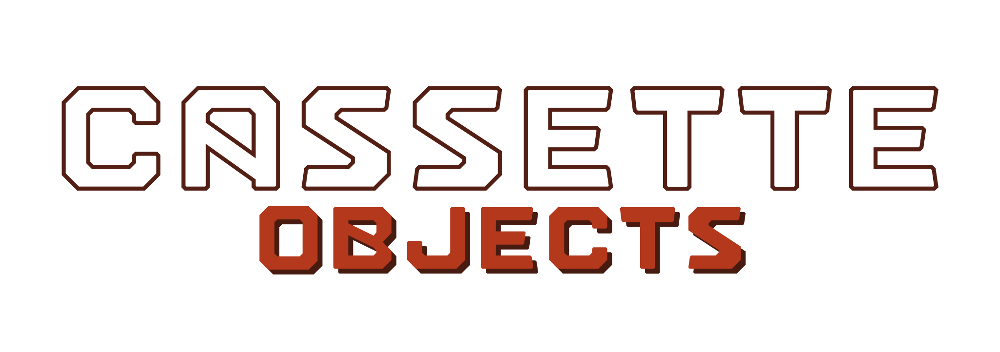

<p align=center></p>

Cassette Objects (COBJ) is a little collection self-contained data structures. Its API is written in a (somewhat) safe C style in which all structures that depend on dynamic memory allocation are opaque and their handler functions are designed to minimize the return of null pointer values. In other words, save for a few explicit exceptions, functions including constructors always return valid values or pointers, even in case of memory allocation failure. 

Features
--------

| Object  | Description                                                                       |
| ------- | --------------------------------------------------------------------------------- |
| cbook   | dynamic C-strings stack with grouping features                                    |
| ccolor  | RGBA color representation, manipulation and conversion                            |
| cdict   | hashmap with string + group keys, FNV-1A hashing and linear probing               |
| cerr    | error codes used by every Cassette component                                      |
| cinputs | 2D input (screen touches, key / button presses) tracker array                     |
| crand   | re-implementation of POSIX's rand48 functions with a slightly more convenient API |
| cref    | reference counter used to keep track of instanced components                      |
| csafe   | set of arithmetics operations on size_t with overflow and underflow protection    |
| cseg    | 1D segment represenation and manipulation with bound checks and UB prevention     |
| cstr    | UTF-8 strings with 2D (rows, columns, tabsize, wrapping) features                 |

Dependencies
------------

- Tools :

	- C11 compiler with a stdlib + POSIX 200809L
	- Make

Installation
------------

First, edit the makefile if you want to change the installation destinations. These are represented by the variables `DIR_INSTALL_INC` and `DIR_INSTALL_LIB` for the public API headers and library files respectively. By default, they are set to `/usr/include/cassette/` and `/usr/lib`.
Then, build and install COBJ with the following commands :

```
make
make install
```

After these steps, both a shared binary and static archive will be generated and installed on your system. Examples will also be built and placed under `build/bin`.

Usage
-----

Add this include to get access to all of the library features :

```
#include <cassette/cobj.h>
```

If you want to be more explicit, you can include the specific headers you need :

```
#include <cassette/cbook.h>
#include <cassette/ccolor.h>
#include <cassette/cdict.h>
#include <cassette/cerr.h>
#include <cassette/crand.h>
#include <cassette/cref.h>
#include <cassette/cseg.h>
#include <cassette/cstr.h>
```

Then, to compile your program, add this flag :

```
-lcobj
```

Mirrors
-------

- https://github.com/fraawlen/cassette-objects
- https://codeberg.org/fraawlen/cassette-objects
