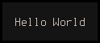

# CGUI Minimal Example

Simple hello world window.

```c
#include <cassette/cgui.h>

int
main(int argc, char **argv)
{
	cgui_window *window;
	cgui_grid   *grid;
	cgui_label  *label;

	/* Instantiation */

	cgui_init(argc, argv);

	window = cgui_window_create();
	grid   = cgui_grid_create(1, 1);
	label  = cgui_label_create();

	/* Cell configuration */

	cgui_label_set(label, "Hello World");
	
	/* Grid configuration */

	cgui_grid_resize_col(grid, 0, 11);
	cgui_grid_assign_cell(grid, label, 0, 0, 1, 1);
	
	/* Window configuration */

	cgui_window_push_grid(window, grid);
	cgui_window_activate(window);

	/* Run */

	cgui_run();

	/* End */

	return 0;
}
```

Compile with :

```
cc hello.c -lcgui
```

Output :


