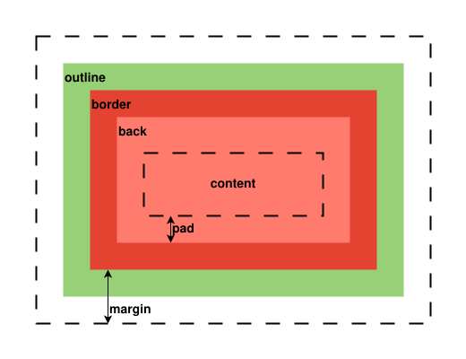
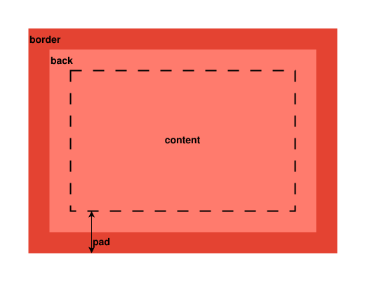
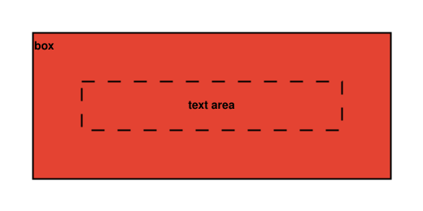
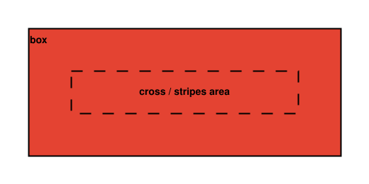
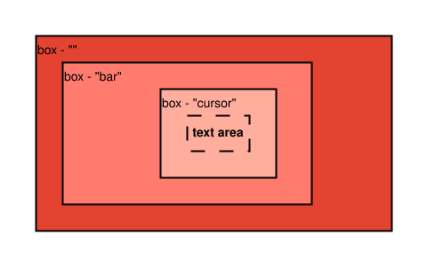

# CGUI Theming

Below is a configuration reference for users who want to customize and theme CGUI programs. Because CGUI's configuration is powered by CCFG, it is assumed that the reader is already familiar with the [CCFG configuration language](ccfg-language.md).

CGUI configuration files can be placed in any of the following paths. When initializing, CGUI will look for these files in sequence and load the first one it finds.

1. path set by the environement variable `CGUI_CONFIG_SOURCE`
2. ~/.config/cassette/cgui.ccfg
3. ~/.config/cgui.ccfg
4. /usr/share/cassette/cgui.ccfg
5. /etc/cassette/cgui.ccfg
6. /etc/cgui.ccfg

If the environement variable `CGUI_CONFIG_HARDCODED_ONLY` is set, these paths will be ignored and only hardcoded values will be used.

## Table of Contents 

- [Datatypes](#types)
- [Generic Box styling](#box-style)
- [Generic Window styling](#window-style)
- [Generic Text styling](#text-style)
- [Input](#input)
- [Font](#font)
- [Rendering](#render)
- [Windows](#windows)
- [Shadows](#shadows)
- [Cell - Filler](#filler)
- [Cell - Label](#label)
- [Cell - Button](#button)
- [Cell - Stripes](#stripes)
- [Cell - Placeholder](#placeholder)
- [Cell - Beacon](#beacon)
- [Cell - Gauge](#gauge)

## Datatypes 

Beyond CCFG's conventions, CGUI defines additional datatypes for its resource values after they've been resolved by CCFG's parser, and performs the appropriate conversions internally to match the right types.

| **Type** | **Description** |
|----------|-----------------|
| STRING   | Plain text, such as a font name, file path, or generic label |
| COLOR    | Color, typically in RGBA hexadecimal notation |
| BOOL     | CCFG boolean (`TRUE` or `FALSE`) |
| OFFSET   | Integer pixel value for X/Y positioning or padding, affected by UI scaling |
| LENGTH   | Strictly positive integer pixel value for sizes or distances, affected by UI scaling |
| LONG     | Generic integer value |
| ULONG    | Strictly positive generic integer value |
| DOUBLE   | Generic decimal value |
| UDOUBLE  | Strictly positive, non-zero decimal value |
| BUTTON   | Mouse button identifier (1-12) |
| DICT     | Case-sensitive word; possible values are resource-specific |

[ <a href="#toc">back to top</a> ]

## Generic Box Styling 

Cells use one or more boxes to form their visual appearance. Similar to the CSS box model, each box defines several resources controlling its look and behavior. In the cell sections, box styles are referred to with the `BOX` datatype.

### Resources

| **Name**        | **Type** | **Description** |
|-----------------|----------|-----------------|
| corner_type     | DICT     | Style of the box's corners |
| corner_size     | LENGTH   | Radius or size of the corner shape |
| outline_size    | LENGTH   | Thickness of the outline |
| border_size     | LENGTH   | Thickness of the border |
| pad             | OFFSET   | Internal padding |
| margin          | OFFSET   | External margin |
| shadow_x_offset | OFFSET   | Horizontal offset of the box's shadow |
| shadow_y_offset | OFFSET   | Vertical offset of the box's shadow |
| outline_color   | COLOR    | Color of the box's outline  |
| border_color    | COLOR    | Color of the box's border |
| back_color      | COLOR    | Background color of the box |
| shadow_color    | COLOR    | Color of the box's shadow |
| outline_shape   | BOOL     | Outline adopts the border's corner shape |
| border_shape    | BOOL     | Border adopts the main box's corner shape |
| draw            | BOOL     | Draw box (including shadow) |
| shadow_draw     | BOOL     | Draw shadow |
| corner_smart    | BOOL     | Override corner shapes and sizes to match the parent box |
| outline_hitbox  | BOOL     | Outline included in the box's hitbox |

### Notes

- `corner_type` and `corner_size` each accept up to four values, for the top-left, top-right, bottom-right, and bottom-left corners in that order. If fewer than four values are provided, the final value is repeated for the remaining corners.
- `corner_type` may be `square`, `round`, or `cut`.

[ <a href="#toc">back to top</a> ]

## Generic Window Styling 

Windows have a simpler box model with commonly named components. In the windows section, window styles are referred to with the `WINDOW` datatype.

### Resources

| **Name**     | **Type** | **Description** |
|--------------|----------|-----------------|
| corner_type  | DICT     | Style of the window's corners |
| corner_size  | LENGTH   | Radius or size of the corner shape |
| border_size  | LENGTH   | Thickness of the border |
| border_color | COLOR    | Color of the window's border |
| back_color   | COLOR    | Background color of the window |
| enabled      | BOOL     | Use this style instead of default |

### Notes

- `corner_type` and `corner_size` each accept up to four values, for the top-left, top-right, bottom-right, and bottom-left corners in that order. If fewer than four values are provided, the final value is repeated for the remaining corners.
- `corner_type` may be `square`, `round`, or `cut`.
- Padding is separate from generic window styling so window size doesn't change when the window states (like focused or disabled) change.

[ <a href="#toc">back to top</a> ]

## Generic Text Styling 

Aside from box styling, cells also feature common properties for drawing text. In the cell sections, text styles are referred to with the `TEXT` datatype.

### Resources

| **Name**          | **Type** | **Description** |
|-------------------|----------|-----------------|
| text_color      | COLOR  | Glyph color |
| text_back_color | COLOR  | Background highlight color |
| text_back_draw  | BOOL   | Draw background highlight |
| text_bold       | BOOL   | weight |

[ <a href="#toc">back to top</a> ]

## Input 

### Resources

| **Namespace** | **Name**          | **Type** | **Default** | **Description** |
|---------------|-------------------|----------|-------------|-----------------|
| input         | modkey            | DICT     | ctrl        | Modifier key input swaps |
| input         | auto_lock         | BOOL     | TRUE        | Allow cells to lock focus |
| input         | sticky_pointer    | BOOL     | FALSE       | Do not unfocus cells when leaving them |
| input         | sticky_touch      | BOOL     | FALSE       | Do not unfocus cells when releasing the touch |
| input         | window_move       | BUTTON   | 0           | Mouse button for dragging windows |
| input         | window_resize     | BUTTON   | 0           | Mouse button for resizing windows |
| input         | window_fullscreen | BUTTON   | 0           | Mouse button for toggling fullscreen |

### Shortcuts

One of CGUI's particularities is its ability to configure exactly how each key and button inputs should be interpreted. It's possible to customize every shortcut, even those set by the app developer. See [here](cgui-input-swap.md) for more information.

### Notes

- `modkey` can be `mod1`, `mod4`, or `ctrl`
- Window related options provide light window management. They are not meant to be a replacement to proper window management. They only get activated outside cells or on cells rejecting pointer focus event (i.e. non interactable cells). The button id 0 disable them.

[ <a href="#toc">back to top</a> ]

## Font 

### Resources

| **Namespace** | **Name**         | **Type** | **Default** | **Description** |
|---------------|------------------|----------|-------------|-----------------|
| font          | pad_pattern      | STRING   | "_"         | Filler pattern for number padding |
| font          | face             | STRING   | "Monospace" | Font face name |
| font          | size             | LENGTH   | 14          | Base font size in pixels |
| font          | spacing_horz     | LENGTH   | 0           | Horizontal column spacing |
| font          | spacing_vert     | LENGTH   | 2           | Vertical row spacing |
| font          | width            | LENGTH   | 7           | Font width if overriding metrics |
| font          | ascent           | LENGTH   | 14          | Font ascent if overriding metrics |
| font          | descent          | LENGTH   | 0           | Font descent if overriding metrics |
| font          | x_offset         | OFFSET   | 0           | Horizontal glyph offset |
| font          | y_offset         | OFFSET   | 0           | Vertical glyph offset |
| font          | override_metrics | BOOL     | FALSE       | Force use of specified metrics |
| font          | hints            | BOOL     | TRUE        | Use font hinting |
| font          | antialias        | DICT     | subpixel    | Antialias mode |
| font          | subpixel         | DICT     | rgb         | Subpixel order |
| font          | bg_vert_pad      | LENGTH   | 0           | Extra vertical padding for text highlight |
| font          | bg_horz_pad      | LENGTH   | 0           | Extra horizontal padding for text highlight |

### Notes

- `antialias` can be `none`, `gray`, or `subpixel`
- `subpixel` can be `rgb`, `bgr`, `vrgb`, or `vbgr`
- Unless `override_metrics` is enabled, `width`, `ascent` and `descent` are automatically set by CGUI using the font's face and size.

[ <a href="#toc">back to top</a> ]

## Rendering 

### Resources

| **Namespace** | **Name**         | **Type** | **Default** | **Description** |
|---------------|------------------|----------|-------------|-----------------|
| render        | mode             | RENDER   | deferred    | Rendering mode |
| render        | scale            | UDOUBLE  | 1.0         | UI scaling factor |
| render        | sync_vblank      | BOOL     | TRUE        | Synchronize rendering with vertical blank |
| render        | sync_bypass      | BOOL     | TRUE        | Bypass vblank sync on window resize or map |
| render        | partial_redraw   | BOOL     | TRUE        | Only redraw cells that need it |
| render        | fps_async_cap    | UDOUBLE  | no limit    | Max framerate when rendering asynchronously |
| render        | fps_sync_divider | ULONG    | 1           | Divider for synced framerate |

### Notes

- The `mode` property accepts `forward` and `deferred`
- In forward mode, the window is first drawn to a pixmap, then presented to the display server to use on a window surface
- In deferred mode, CGUI first waits for a signal from the display server, then starts drawing directly on the window surface without an intermediate pixmap
- Because of unresolved issues mixing 32-bit depth pixmaps, Cairo, and XCB windows, forward mode uses standard 24-bit depth. If you run a compositor and need transparency, enable deferred mode. However, in deferred mode, if `sync_vblank` is disabled and you're not using a compositor, windows can flicker when being redrawn. General recommendation:  
	 - forward mode when running uncomposited X  
	 - deferred mode if transparency is wanted  
- `fps_async_cap` only matters if `sync_vblank` is disabled. Setting it to 0 means no framerate limit
- `fps_sync_divider` divides the synced framerate by a whole number
- Both fps control options can reduce CPU load at the cost of animation smoothness
- `sync_bypass` removes the "lag" of window content when resizing a windows on uncomposited X
- When `partial_redraw` is enabled only cells that need it are redrawn, improving performance
- Disabling `partial_redraw` is useful when dealing themes that feature cells changing size between state (like a button becoming smaller when pressed), themes that feature overlapping cells or when reactive shadows are enabled.

[ <a href="#toc">back to top</a> ]

## Grids 

### Resources

| **Namespace** | **Name** | **Type** | **Default** | **Description** |
|---------------|----------|----------|-------------|-----------------|
| grid          | pad      | LENGTH   | 18          | Padding between the cell edges and content |
| grid          | gap      | LENGTH   | 10          | Spacing between cells within a grid |

### Notes

- These values follow the [WGC model](ui-model.md). Together with fonts, window padding, and popup padding, they define CGUI window dimensions.

[ <a href="#toc">back to top</a> ]

## Windows 

### Resources

| **Namespace**   | **Name**  | **Type** | **Default** | **Description** |
|-----------------|-----------|----------|-------------|-----------------|
| window          | pre_focus | BOOL     | TRUE        | Focus the window before showing |
| window          | pad       | LENGTH   | 19          | Padding around window content |
| window          |           | WINDOW   |             | Default windows style |
| window_focused  |           | WINDOW   |             | Style for focused windows |
| window_disabled |           | WINDOW   |             | Style for disabled windows |
| window_locked   |           | WINDOW   |             | Style for windows with locked grids |
| popup           | pad       | LENGTH   | 13          | Padding around popup content |
| popup           |           | WINDOW   |             | Style for popups |

### Window defaults

| **Name \ Namespace** | **window** | **window_focused** | **window_disabled** | **window_locked** | **popup** |
|----------------------|------------|--------------------|---------------------|-------------------|-----------|
| corner_type          | square     | square             | square              | square            | square    |
| corner_size          | 0          | 0                  | 0                   | 0                 | 0         |
| border_size          | 6          | 6                  | 6                   | 6                 | 6         |
| border_color         | #808080FF  | #CCCCCCFF          | #000000FF           | #CC0000FF         | #00CCCCFF |
| back_color           | #202020FF  | #202020FF          | #202020FF           | #202020FF         | #202020FF |
| enabled              |            | TRUE               | TRUE                | TRUE              | TRUE      |

### Notes

- `pre_focus` is useful if the window manager doesn’t automatically focus newly mapped windows, helping avoid flicker when a window gets focused only after mapping.
- Padding is separate from window styling so window size doesn't change when states (like focused or disabled) change.
- For the default window state, `enabled` does not matter.

[ <a href="#toc">back to top</a> ]

## Shadows 

### Resources

| **Namespace** | **Name**           | **Type** | **Default** | **Description** |
|---------------|--------------------|----------|-------------|-----------------|
| shadows       | reactive           | BOOL     | FALSE       | Cell shadows follow the mouse pointer |
| shadows       | max_light_distance | LENGTH   | 200         | Maximum pointer distance from a cell's center |
| shadows       | max_offset         | LENGTH   | 10          | Maximum offset for reactive shadows |

### Notes

- These settings only apply if reactive shadows are enabled and cells draw their own shadows.

[ <a href="#toc">back to top</a> ]

## Cell - Filler 

### Resources

| **Namespace** | **Name**   | **Type** | **Default** | **Description** |
|---------------|------------|----------|-------------|-----------------|
| filler        |            | BOX      |             | Frame |

### Box defaults

| **Name \ Namespace** | **filler** |
|----------------------|------------|
| corner_type          | square     |
| corner_size          | 0          |
| outline_size         | 0          |
| border_size          | 3          |
| pad                  | 15         |
| margin               | 0          |
| shadow_x_offset      | 0          |
| shadow_y_offset      | 0          |
| outline_color        | #808080FF  |
| border_color         | #808080FF  |
| back_color           | #404040FF  |
| shadow_color         | #000000FF  |
| outline_shape        | TRUE       |
| border_shape         | TRUE       |
| draw                 | TRUE       |
| shadow_draw          | FALSE      |
| corner_smart         | TRUE       |
| outline_hitbox       | FALSE      |

[ <a href="#toc">back to top</a> ]

## Cell - Label 

### Resources

| **Namespace** | **Name**   | **Type** | **Default** | **Description** |
|---------------|------------|----------|-------------|-----------------|
| label         |            | BOX      |             | Frame |
| label         |            | TEXT     |             | Label |

### Box defaults

| **Name \ Namespace** | **label** |
|----------------------|-----------|
| corner_type          | square    |
| corner_size          | 0         |
| outline_size         | 0         |
| border_size          | 3         |
| pad                  | 15        |
| margin               | 0         |
| shadow_x_offset      | 0         |
| shadow_y_offset      | 0         |
| outline_color        | #808080FF |
| border_color         | #808080FF |
| back_color           | #404040FF |
| shadow_color         | #000000FF |
| outline_shape        | TRUE      |
| border_shape         | TRUE      |
| draw                 | TRUE      |
| shadow_draw          | FALSE     |
| corner_smart         | TRUE      |
| outline_hitbox       | FALSE     |

### Text defaults

| **Name \ Namespace** | **label** |
|----------------------|-----------|
| text_color           | #FFFFFFFF |
| text_back_color      | #000000FF |
| text_back_draw       | FALSE     |
| text_bold            | FALSE     |

[ <a href="#toc">back to top</a> ]

## Cell - Button 

### Resources

| **Namespace**   | **Name**   | **Type** | **Default** | **Description** |
|-----------------|------------|----------|-------------|-----------------|
| button_idle     |            | BOX      |             | Default frame |
| label_idle      |            | TEXT     |             | Default label style |
| button_focused  |            | BOX      |             | Frame when button is focused |
| button_focused  |            | TEXT     |             | Label when button is focused |
| button_pressed  |            | BOX      |             | Frame when button is activated |
| button_pressed  |            | TEXT     |             | Label when button is activated |
| button_disabled |            | BOX      |             | Frame when button is disabled |
| button_disabled |            | TEXT     |             | Label when button is disabled |

### Box defaults

| **Name \ Namespace** | **button_idle** | **button_focused** | **button_pressed** | **button_disabled** |
|----------------------|-----------------|--------------------|--------------------|---------------------|
| corner_type          | square          | square             | square             | square              |
| corner_size          | 0               | 0                  | 0                  | 0                   |
| outline_size         | 0               | 0                  | 0                  | 0                   |
| border_size          | 3               | 3                  | 3                  | 3                   |
| pad                  | 15              | 15                 | 15                 | 15                  |
| margin               | 0               | 0                  | 0                  | 0                   |
| shadow_x_offset      | 0               | 0                  | 0                  | 0                   |
| shadow_y_offset      | 0               | 0                  | 0                  | 0                   |
| outline_color        | #808080FF       | #808080FF          | #808080FF          | #808080FF           |
| border_color         | #808080FF       | #CCCCCCFF          | #808080FF          | #808080FF           |
| back_color           | #602000FF       | #A04000FF          | #FFFFFFFF          | #301000FF           |
| shadow_color         | #000000FF       | #000000FF          | #000000FF          | #000000FF           |
| outline_shape        | TRUE            | TRUE               | TRUE               | TRUE                |
| border_shape         | TRUE            | TRUE               | TRUE               | TRUE                |
| draw                 | TRUE            | TRUE               | TRUE               | TRUE                |
| shadow_draw          | FALSE           | FALSE              | FALSE              | FALSE               |
| corner_smart         | TRUE            | TRUE               | TRUE               | TRUE                |
| outline_hitbox       | FALSE           | FALSE              | FALSE              | FALSE               |

### Text defaults

| **Name \ Namespace** | **button_idle** | **button_focused** | **button_pressed** | **button_disabled** |
|----------------------|-----------------|--------------------|--------------------|---------------------|
| text_color           | #FFFFFFFF       | #FFFFFFFF          | #000000FF          | #808080FF           |
| text_back_color      | #000000FF       | #000000FF          | #000000FF          | #000000FF           |
| text_back_draw       | FALSE           | FALSE              | FALSE              | FALSE               |
| text_bold            | FALSE           | FALSE              | TRUE               | FALSE               |

[ <a href="#toc">back to top</a> ]

## Cell - Stripes 

### Resources

| **Namespace** | **Name**   | **Type** | **Default** | **Description** |
|---------------|------------|----------|-------------|-----------------|
| stripes       | line_color | COLOR    | #808080FF   | Color of stripes |
| stripes       | line_width | LENGTH   | 3           | Thickness of stripes |
| stripes       | line_gap   | LENGTH   | 15          | Gap between stripes |
| stripes       |            | BOX      |             | Frame |

### Box defaults

| **Name \ Namespace** | **stripes** |
|----------------------|-------------|
| corner_type          | square      |
| corner_size          | 0           |
| outline_size         | 0           |
| border_size          | 3           |
| pad                  | 0           |
| margin               | 0           |
| shadow_x_offset      | 0           |
| shadow_y_offset      | 0           |
| outline_color        | #808080FF   |
| border_color         | #808080FF   |
| back_color           | #404040FF   |
| shadow_color         | #000000FF   |
| outline_shape        | TRUE        |
| border_shape         | TRUE        |
| draw                 | TRUE        |
| shadow_draw          | FALSE       |
| corner_smart         | TRUE        |
| outline_hitbox       | FALSE       |

[ <a href="#toc">back to top</a> ]

## Cell - Placeholder 

### Resources

| **Namespace** | **Name**   | **Type** | **Default** | **Description** |
|---------------|------------|----------|-------------|-----------------|
| placeholder   | line_color | COLOR    | #808080FF   | Color of the cross lines |
| placeholder   | line_width | LENGTH   | 3           | Thickness of the cross lines |
| placeholder   |            | BOX      |             | Frame |

### Box defaults

| **Name \ Namespace** | **placeholder** |
|----------------------|-----------------|
| corner_type          | square          |
| corner_size          | 0               |
| outline_size         | 0               |
| border_size          | 3               |
| pad                  | 0               |
| margin               | 0               |
| shadow_x_offset      | 0               |
| shadow_y_offset      | 0               |
| outline_color        | #808080FF       |
| border_color         | #808080FF       |
| back_color           | #404040FF       |
| shadow_color         | #000000FF       |
| outline_shape        | TRUE            |
| border_shape         | TRUE            |
| draw                 | TRUE            |
| shadow_draw          | FALSE           |
| corner_smart         | TRUE            |
| outline_hitbox       | FALSE           |

[ <a href="#toc">back to top</a> ]

## Cell - Beacon 

### Resources

| **Namespace**   | **Name**  | **Type** | **Default** | **Description** |
|-----------------|-----------|----------|-------------|-----------------|
| beacon          | blink_on  | ULONG    | 500         | Duration of beacon’s on phase in critical state |
| beacon          | blink_off | ULONG    | 500         | Duration of beacon’s off phase in critical state |
| beacon_on       |           | BOX      |             | Frame in ON state |
| beacon_on       |           | TEXT     |             | Label in ON state |
| beacon_off      |           | BOX      |             | Frame in OFF state |
| beacon_off      |           | TEXT     |             | Label in OFF state |
| beacon_crit_on  |           | BOX      |             | Frame in Critical state when blinking on |
| beacon_crit_on  |           | TEXT     |             | Label in Critical state when blinking on |
| beacon_crit_off |           | BOX      |             | Frame in Critical state when blinking off |
| beacon_crit_off |           | TEXT     |             | Label in Critical state when blinking off |

### Box defaults

| **Name \ Namespace** | **beacon_off** | **beacon_on** | **beacon_crit_off** | **beacon_crit_on** |
|----------------------|----------------|---------------|---------------------|--------------------|
| corner_type          | square         | square        | square              | square             |
| corner_size          | 0              | 0             | 0                   | 0                  |
| outline_size         | 3              | 3             | 3                   | 3                  |
| border_size          | 6              | 6             | 6                   | 6                  |
| pad                  | 9              | 9             | 9                   | 9                  |
| margin               | 3              | 3             | 3                   | 3                  |
| shadow_x_offset      | 0              | 0             | 0                   | 0                  |
| shadow_y_offset      | 0              | 0             | 0                   | 0                  |
| outline_color        | #808080FF      | #808080FF     | #808080FF           | #9B2E21FF          |
| border_color         | #202020FF      | #401A16FF     | #202020FF           | #401A16FF          |
| back_color           | #404040FF      | #9B2E21FF     | #404040FF           | #9B2E21FF          |
| shadow_color         | #000000FF      | #000000FF     | #000000FF           | #000000FF          |
| outline_shape        | TRUE           | TRUE          | TRUE                | TRUE               |
| border_shape         | TRUE           | TRUE          | TRUE                | TRUE               |
| draw                 | TRUE           | TRUE          | TRUE                | TRUE               |
| shadow_draw          | FALSE          | FALSE         | FALSE               | FALSE              |
| corner_smart         | TRUE           | TRUE          | TRUE                | TRUE               |
| outline_hitbox       | FALSE          | FALSE         | FALSE               | FALSE              |

### Text defaults

| **Name \ Namespace** | **beacon_off** | **beacon_on** | **beacon_crit_off** | **beacon_crit_on** |
|----------------------|----------------|---------------|---------------------|--------------------|
| text_color           | #FFFFFFFF      | #FFFFFFFF     | #FFFFFFFF           | #FFFFFFFF          |
| text_back_color      | #000000FF      | #000000FF     | #000000FF           | #000000FF          |
| text_back_draw       | FALSE          | FALSE         | FALSE               | FALSE              |
| text_bold            | FALSE          | TRUE          | FALSE               | TRUE               |

### Notes

- Each beacon state (off, on, critical off/on) have its own box and text styling.
- In critical state, the beacon is blinking between an on and off state.
- `blink_on` and `blink_off` are expressed in milliseconds.

[ <a href="#toc">back to top</a> ]

## Cell - Gauge 

### Resources

| **Namespace** | **Name** | **Type** | **Default** | **Description** |
|---------------|----------|----------|-------------|-----------------|
| gauge_cursor  | min_size | LENGTH   | 20          | Minimum length or size of gauge cursor |
| gauge_bar     | max_size | LENGTH   | no limit    | Maximum thickness or size of the gauge bar |
| gauge         |          | BOX      |             | Frame |
| gauge_bar     |          | BOX      |             | Progress bar |
| gauge_cursor  |          | BOX      |             | Cursor with label |

### Box defaults

| **Name \ Namespace** | **gauge** | **gauge_bar** | **gauge_cursor** |
|----------------------|-----------|---------------|------------------|
| corner_type          | square    | square        | square           |
| corner_size          | 0         | 0             | 0                |
| outline_size         | 0         | 0             | 0                |
| border_size          | 3         | 3             | 3                |
| pad                  | 3         | -3            | 9                |
| margin               | 0         | 0             | 0                |
| shadow_x_offset      | 0         | 0             | 0                |
| shadow_y_offset      | 0         | 0             | 0                |
| outline_color        | #808080FF | #808080FF     | #808080FF        |
| border_color         | #808080FF | #808080FF     | #808080FF        |
| back_color           | #404040FF | #003030FF     | #004545FF        |
| shadow_color         | #000000FF | #000000FF     | #000000FF        |
| outline_shape        | TRUE      | TRUE          | TRUE             |
| border_shape         | TRUE      | TRUE          | TRUE             |
| draw                 | TRUE      | TRUE          | TRUE             |
| shadow_draw          | FALSE     | FALSE         | FALSE            |
| corner_smart         | TRUE      | TRUE          | TRUE             |
| outline_hitbox       | FALSE     | FALSE         | FALSE            |

### Text defaults

| **Name \ Namespace** | **gauge** |
|----------------------|-----------|
| text_color           | #FFFFFFFF |
| text_back_color      | #000000FF |
| text_back_draw       | FALSE     |
| text_bold            | FALSE     |

### Notes

- Each box used by the gauge has its own namespace for styling.

[ <a href="#toc">back to top</a> ]

