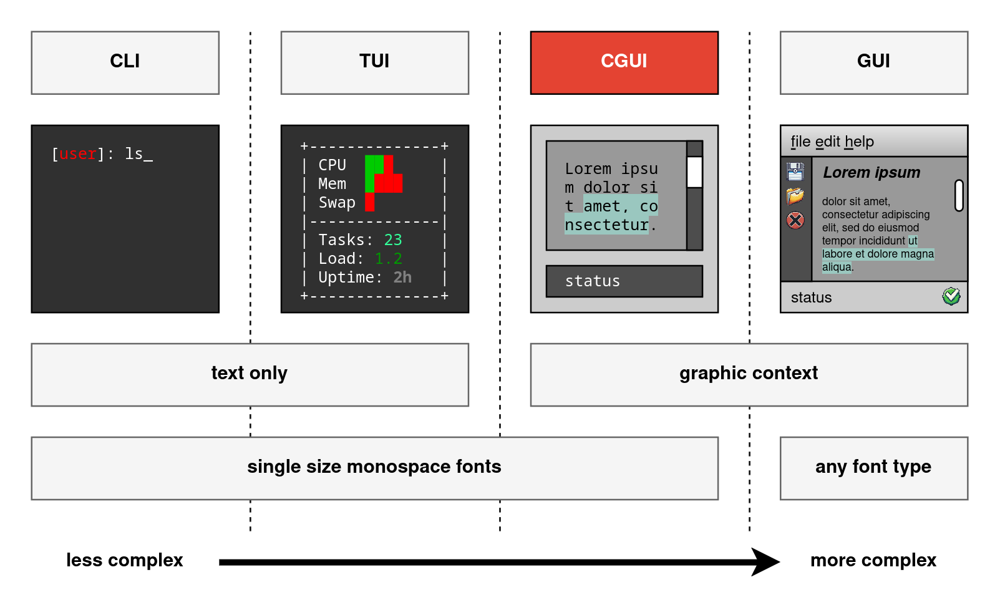
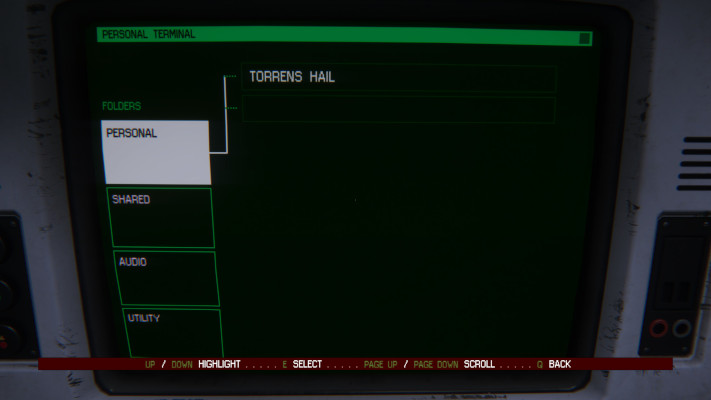
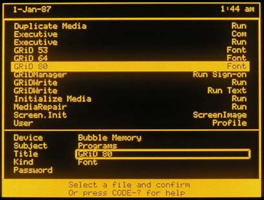
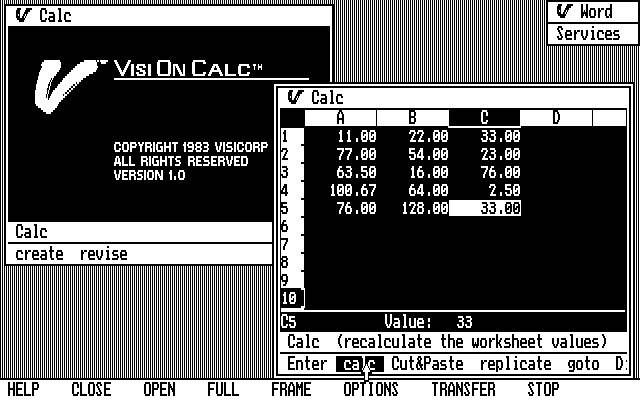
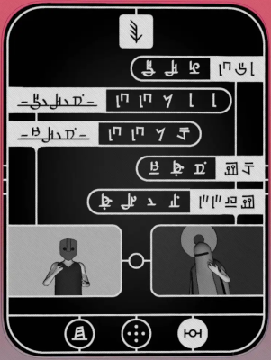
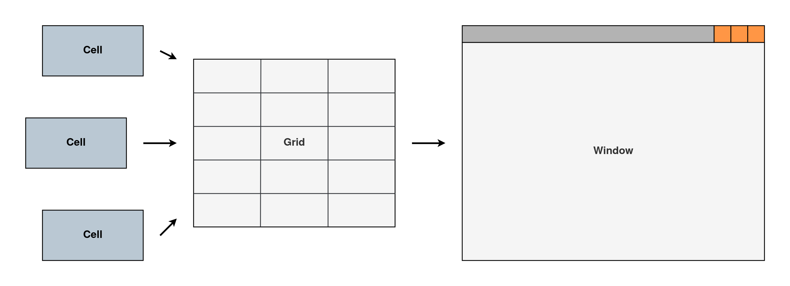
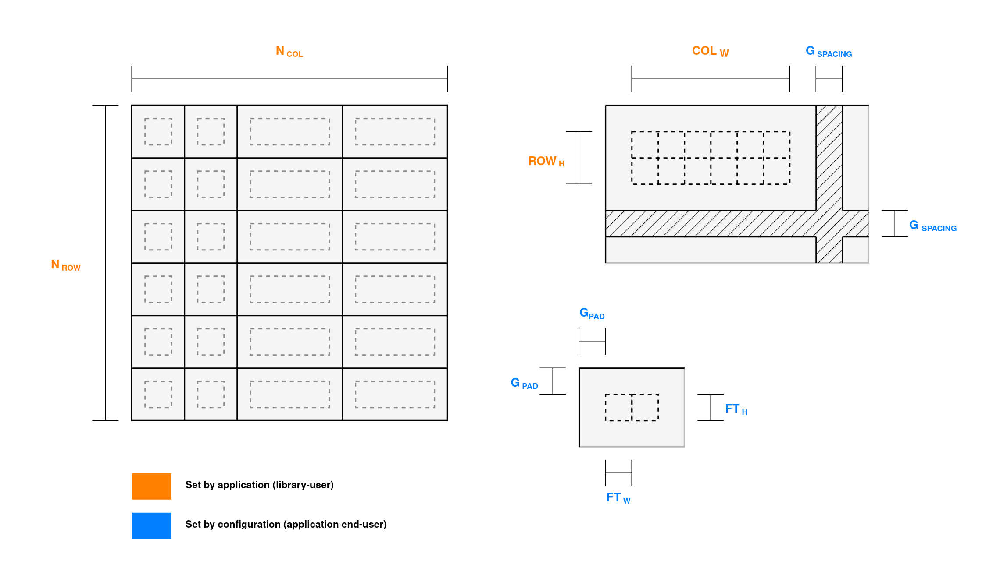
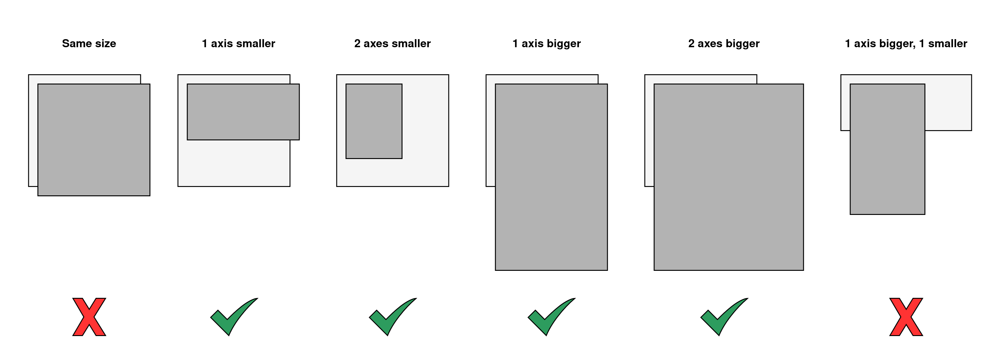
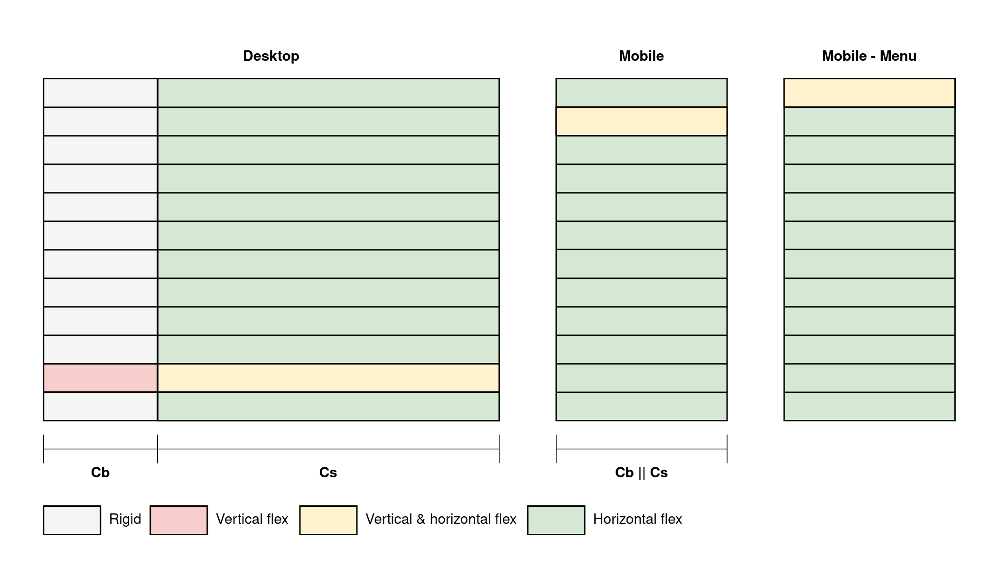
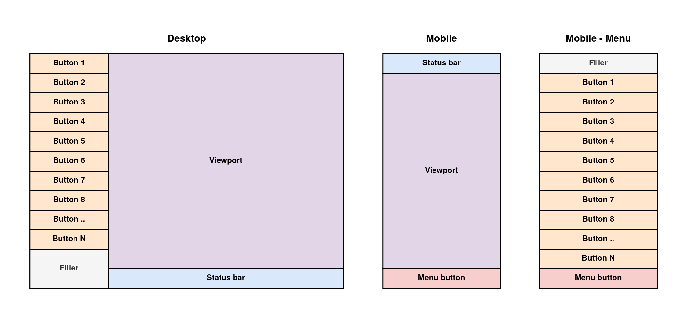

# UI Model

The Cassette GUI library (CGUI) is designed for desktop, mobile, and other GUI applications while maintaining high configurability and a clear separation of concerns between library users and application end-users. Library users are responsible for setting up components, defining states, and organizing layouts. Meanwhile, application end-users are given maximum freedom to configure and theme the library according to their preferences or device limitations (screen size, input methods, ...).

To achieve this balance, CGUI features an universal grid layout system paired with simple but highly customizable widgets, striving to be as device-agnostic as possible. However, despite this pitch, not every CGUI application will suit every device. For instance, a phone application might not adapt well to a desktop environment, and a complex image editor may be impractical on a small smartphone screen. But in both scenarios, CGUI can provide the tools to make these applications.

To do so, CGUI's layout system adheres to the **Window-Grid-Cell paradigm (WGC)**, which features 3 type of UI components:
- **Windows** that act as top-level containers.
- **Grids** that serve as layout structures assigned to these windows.
- **Cells** that are individual widgets arranged within grids.

## Table of contents

- [Design Philosophy](#design)
- [WGC Paradigm](#paradigm)
- [Practical Example](#example)

## Design Philosophy 

The overall look and feel of CGUI, as its name "Cassette" suggests, is inspired by the Cassette-Futurism style and is favoring simple text-based widgets over icons or other pixmaps. Graphics are used exclusively for widgets where displaying visuals is essential, which is why the default cell selection in CGUI does not include support for icons. To ensure compatibility across a wide range of devices with varying screen resolutions and densities, simple vector graphics are prioritized. CGUI’s cell drawing API is intentionally minimalistic, featuring only two core drawing primitives: boxes and text, with most widgets designed using just these elements. This uniformity not only simplifies cells designs but also ensures easy and consistent theming across applications. Additionally, thanks to its support for responsive layouts, it is capable of powering applications that adapt seamlessly to multiple device classes.

<em>Visually speaking, CGUI can be situated in the niche between TUIs and traditional GUIs</em>

||||
|--|--|--|

<em>Although CGUI is inspired by the retro-futurist aesthetic, its extensive <a href="cgui-theming.md">configuration options</a>, powered by <a href="ccfg-language.md">CCFG</a>, allow it to adapt to a wide range of visual styles</em>

|||||
|--|--|--|--|

<em>Some of the inspiration used in designing CGUI <a href="https://www.sega.com/alien-isolation/alien-isolation">[1]</a><a href="https://dons-deals.blogspot.com/2012/08/grid-compass-computer-pioneering-laptop.html">[2]</a><a href="http://toastytech.com/guis/vision3.html">[3]</a><a href="https://www.rundisc.io/chants-of-sennaar/">[4]</a></em>

## WGC Paradigm 

At the heart of CGUI’s layout system is the Window-Grid-Cell (WGC) paradigm, which defines how the library structures and organizes user interfaces. This paradigm divides the interface into three distinct components, each with a specific role in defining the layout and functionality of an application.

<em>The WGC paradigm, cells go into grids, grids go into windows</em>

### Windows

The Window is the topmost container in the hierarchy, serving as the foundation for all visual elements. Each window represents a self-contained space capable of hosting grids and rendering cells on its surface. It is also the primary entry point for events, which are first routed to the visible grid and then passed on to the relevant cells.

A defining feature of the WGC paradigm is that application developers do not need to manually specify the height or width of "normal" windows. Instead, the dimensions of a window are computed automatically based on the properties of the grid assigned to it. This approach simplifies the layout process and ensures that windows dynamically adapt to their content.

### Grids

Within each window, the Grid serves as the primary layout mechanism. Grids are designed to minimize the nesting of components typically found in UIs that primarily uses H-Boxes or V-Boxes components, effectively "flattening" the GUI structure. A grid is defined by its number of rows and columns, with each row and column assigned a size and flexibility factor.

Unlike most systems, the size of rows and columns in CGUI is not measured in pixels but in single-width monospace glyphs. For example, a column width of 11 corresponds to the ability to fit 11 monospace glyphs (e.g., "Hello World"), regardless of the font face, font size, or horizontal spacing. The total dimensions of the grid—including row and column sizes, inter-cell spacing, and cell padding—determine the minimum size of the window hosting the grid. If the font size changes, the grid adjusts its dimensions accordingly, as does the minimum size of the window.  This system ensures that end-users can freely customize font choices, column and row spacing, and padding values without interfering with the programmer-defined layout.

<em>Grid properties: N_row, N_col, ROW_h, COL_w, G_spacing, G_pad, FT_h, and FT_w represent, respectively: the number of rows and columns, row and column sizes (in glyph count), grid inter-cell spacing, grid intra-cell padding, and the monospace font height and width (with vertical and horizontal inter-glyph spacing).</em>

Flexibility governs how rows and columns grow when the window is resized. Each row or column’s flex factor represents a unitless growth proportion, similar to CSS flexbox. For example, if all rows and columns have a flex factor of 1.0, the remaining space (after subtracting the grid’s minimum dimensions) is distributed equally. Conversely, if the combined flexibility across all rows or columns is 0.0, the window becomes rigid and non-resizable along that axis.

### Cells

Cells, or widgets, are the individual building blocks of the user interface. Each cell encapsulates functionality and state within an area that spans one or more rows and columns in a grid. Cells can range from simple text labels to complex interactive elements such as sliders, input fields, or embedded graphical content. Some specialized cells, such as "group" type cells, can even host their own grids or windows, allowing for more sophisticated layouts that "break" the grid.

Cells cannot be directly assigned to a window; they must always reside within a grid or within other cells (called meta-cells) that accept them as input.  That is because, unlike grids or windows, cells themselves do not store geometric information. A cell does not know its size, position, or the grid or window to which it belongs. This information is dynamically supplied when the cell is drawn or receives an event. This separation of concerns further encourages the use of simple, vector-rendered designs for cells, as they can easily adapt to varying sizes and aspect ratios without requiring extensive manual adjustments.

### Responsive Layouts

With CGUI’s purpose centered around creating device-agnostic UIs, the WGC paradigm naturally extends to support responsive layouts. This is achieved by allowing developers to assign multiple grids to the same window, each tailored for specific sizes or aspect ratios. As the window is resized, the largest grid that fits within the window’s dimensions is automatically selected and displayed, ensuring the interface remains both functional and visually optimized across a wide range of devices, screen sizes, and aspect ratios.

For this system to work smoothly, every grid added to a window must be strictly larger or smaller than the previously added grids. Most importantly, a grid cannot be larger on one axis while being smaller on the other. Additionally, grids of the same size—defined as having the same number of rows and columns, and the same cumulative row and column sizes (measured in glyph counts)—cannot be assigned to the same window.

<em>Multi-grid assignment rules</em>

Smaller grids, by nature, cannot display as much content as larger ones. Therefore, a mechanism is needed to allow cells assigned to a grid to change position, be added, or be removed dynamically. To simplify the creation and management of grids with dynamic content, the WGC paradigm supports a feature called grid swapping. Instead of creating a single grid with dynamically shown or hidden cells (e.g., a retractable sidebar), developers can use multiple grids of the same size. A default grid can be paired with another grid containing the additional content, such as the sidebar (while simultaneously excluding the cells hidden by that sidebar). Grids can then be swapped seamlessly. This approach ensures that after setting up their grids, windows, and cells, developers can swap entire layouts without micromanaging the details of their components. The CGUI API further simplifies this process by providing a grid cloning feature, which allows developers to create a template grid with pre-configured properties and common cells, and then add only the differences to cloned grids.

When multiple grids are used, the intent is typically to present the same overall content with different layouts suited to varying conditions. Manually creating and synchronizing separate cell instances for each grid would be cumbersome. To address this, the WGC system allows the same cell instance to be assigned to multiple grids. When a grid is replaced, the cell retains its internal data and state, ensuring seamless transitions between layouts. Additionally, the system does not prohibit assigning the same cell instance multiple times to the same grid. However, it is generally assumed that only one assignment of a cell instance will be visible at a time. Unless specified otherwise in a cell’s documentation, simultaneously displaying multiple assignments of the same cell instance is considered undefined behavior. But as a general rule of thumb, cells that do not respond to user input and whose rendering is not time-based (e.g., static content) are safe to display multiple times within the same grid or across different windows.

## Practical example 

To demonstrate the WGC paradigm, let’s design a generic application with a responsive layout. The app will feature a single window but two main layouts: one for desktop and another for mobile. In desktop mode, the app will include a sidebar with buttons on the left, a status bar at the bottom-right, and a viewport in the top-right. In mobile mode, the app will rearrange to show the status bar at the top, the viewport in the middle, and a button at the bottom that opens a pseudo-overlay to display the buttons from the desktop’s sidebar.

### Initialization

After initializing CGUI, the developer needs to instantiate the following components:
- 1 window
- 1 grid for the desktop layout, 
- 2 grids for the mobile layout: a default one, and one menu overlay
- 1 cell for the status bar
- 1 cell for the viewport
- 1 cell for the menu button in mobile mode
- 1 filler cell for gaps
- N cells for the buttons in the sidebar

### Cell configuration

Next, configure the content, labels, and functionality of each cell. For instance, define what happens when a button is clicked, or what the viewport should display.

A special case is the menu button. When the default mobile grid is active, clicking the button should swap the default grid with the mobile menu grid. Conversely, when the menu grid is active, clicking the button should swap back to the default mobile grid.

### Grid configuration

The desktop grid features 2 columns and N+2 rows:
- The left column (for the sidebar) has its flexibility set to 0.0, as do the first N rows (for the buttons) and the last row (for the status bar).
- The right column and the (N+1)th row (for the viewport) have their flexibility set to 1.0, allowing them to stretch with the window.
- The height of all rows is 1.
- The left column’s width is set to the horizontal glyph count (Cb) of the longest button label.
- The right column’s width is set to the horizontal glyph count (Cs) of the status bar label.

This configuration ensures that the sidebar and status bar remain fixed in size, while the viewport adapts to the available space. If the sidebar needs to be resizable, a meta-cell with resizing handles could be used instead.

---

The default mobile grid uses 1 column and N+2 rows:
- All rows have a height of 1, and the column has a width equal to the larger of Cb and Cs.
- The second row (that the viewport spans) has its flexibility set to 1.0, while all other rows are fixed at 0.0.
- The column’s flexibility is also set to 1.0.

The mobile menu grid mirrors the mobile grid’s properties but swaps the flexible row. Instead of the viewport’s row being flexible, the top row (an empty space) is set to stretch.

---

These grid configurations ensure that the desktop grid is always strictly larger than the mobile grids because: It has 2 columns instead of 1 and its cumulative column width is Cb + Cs compared to just Cb or Cs for the mobile grids.

---

<em>Grid configuration</em>

### Cell Assignment

Once the grids are configured, assign the cells to their respective positions. The filler cell helps maintain a consistent appearance by occupying unused space in the sidebar or mobile menu.

<em>Cell assignment on grids</em>

### Window configuration

The final step is to assign the desktop grid and default mobile grid to the window, along with configuring additional window-specific parameters, such as the title. Because the grid swapping is triggered within a callback function (executed when the menu button is clicked), no further steps are needed. Once these configurations are complete, the application can enter its main event loop, leaving the rest to the GUI library engine.

### Final result

The final application demonstrates a fully responsive design, seamlessly transitioning between desktop and mobile layouts. The menu button allows mobile users to access additional functionality via the menu grid, while the desktop layout makes full use of the available screen space.

